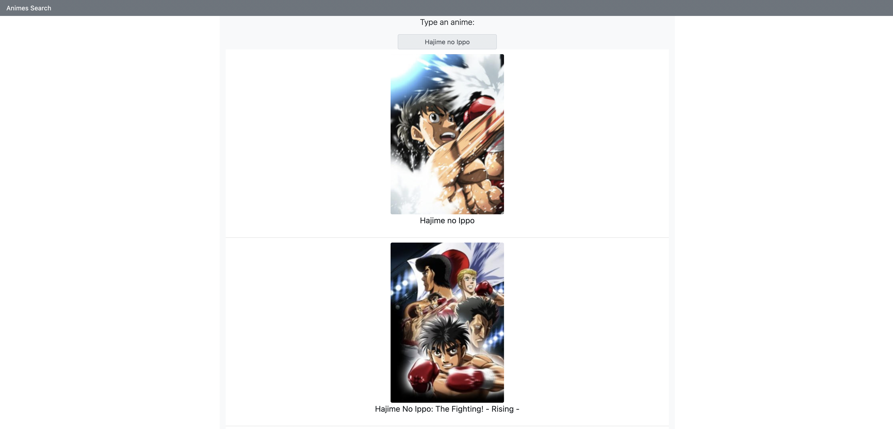

# Animes List
  []("#") 
 
 > Animes List is an web application that the user search for an anime name and see an list with images and titles  as response. 
The website searchs data about the search of user throught an extern API.




##  Instructions

On terminal, execute the command:

```sh
git clone https://github.com/Danethree/animeslist.git
```

On project folder, execute the command:

```sh
npm run dev
```
